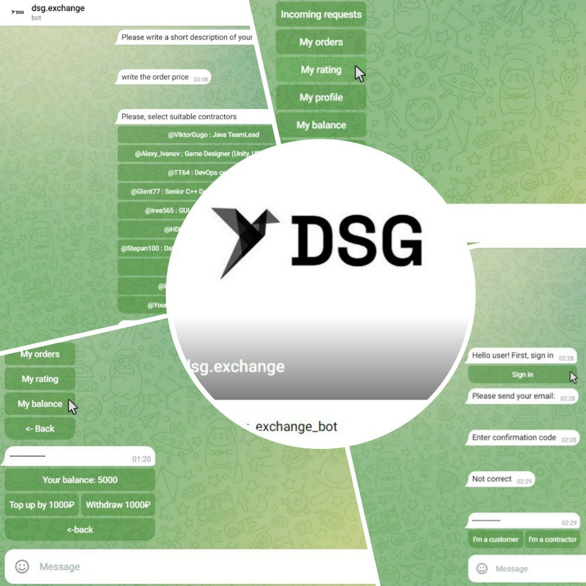

  
  <h2 align="center">Freelance Telegram bot from team Q&D</h2>

  
  

## About project
Freelance exchange Telegram bot. We have implemented a system in which the distance between the customer and the contractor is reduced as much as possible, and the use of the platform is intuitive and understandable to any user.

## Why we chose Telegram-bot?
* **Flexibility**: The introduction of new functions or the elimination of errors is much faster than with other versions of the system implementation.
* **Popularity**: Telegram is one of the most popular social networks in the world, in Russia and we enjoy the support of the Russian government.
* **Availability**: Telegram is perfectly adapted for both the phone and the computer.

## Advantages of dsg.exchange
1. **The popularity of the platform** Telegram is one of the most popular social networks, which is used by more than 800 million people every month.
2. **Shortening the distance** Due to the presence of the exchange in the Telegram ecosystem, the distance between the customer and the contractor is reduced
3. **Security** Two-factor authentication, as well as Telegram encryption tools, ensure user privacy.
4. **Opportunities** All performers see a new order and can respond to it, but also customers can offer an order to the most suitable performers.
